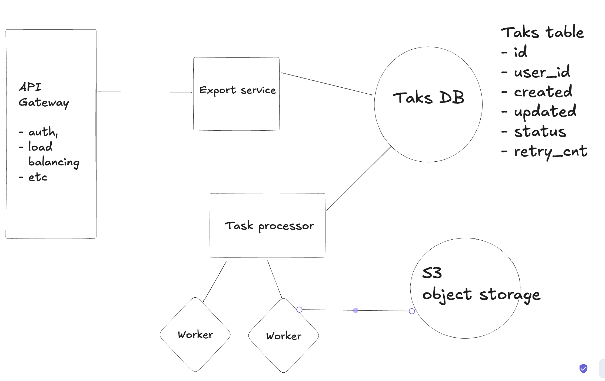

# Async file import design

Befor diving into potential solutions I wanted to emphasise that in real world,
before making any technical desicions or assumptions I'd gather as much information as possible about user, the nature of the load, potential scaling demand, time to store
the data, etc. Basically getting functional and non-functional requirements of the system.

Since the task does not specify any of that, I'll try to imagine some potential solutions and go over their pros and cons.

For starters I propose to start with a simple design that would satisfy our needs:

So, the following solution is quite straighforward:

- **Gateway** handles auth, routing, load balancing
- **Export service** (multiple instances) is a very lightweight API service that
  basically register a task and return OK (200).
- **Task DB** (we can pick different DBs here, both DynamoDB or Postgres should work) consists of a simple table that contains an information about task
- **Task processor** - a service that periodically polls the DB and fetches pending tasks; this is also an orchestrator that delegate tasks to workers
- **Worker** - can be a process/separate service or node that compiles the file, stores it on S3 (any blob storage) and sends the email to the client (can send a PresignURL);

Technically, to optimise workers further we can have another service that would poll tasks that have finished generating a file and then collect them and send emails.
The final URL can be stored in the `status` field.

This simple solution for handles async flow, genarates files in the background and delivers those files to users.
However there are a few flaws with the current solution:

- if we have a large volume of request for export this will create pressure on DB,
  as in the current solution it plays the role of "task queue"
- while task processor handles retries, and ensures we process tasks correctly, if we add more instances we have to ensure that do not process the same task twice, plus the connection between processor and workers is unreliable.

### Addressing large volume of incoming request

I'd favour a simple solution instead of complicated one, hence, simply scalling API services and DB instances should help in most cases.
If not, we can introduce a message queue (Kafka or RabbitMQ) between our API services and the DB.
This should smooth any potential bursts of traffic.

### Tasks processor and workers

The task processor can still run with some interval (this is simple and reliable).
However, as an improvement it should only be responsible for data fetching from the DB.
Afte it fetches the data it should push it to a message queue.
For this particular usecase - AWS SQS makes a good fit due to the following features

- delayed messages (we can delivery a message to a worker after some delay)
- visibility timeouts (handle retries)
- scalability

Workers can be implemented as separate services or like cloud functions (Lambda)
To ensure reliablity we can split file creation and email delivery.
So, when a worker finishes creating a file it can create another task to send an email,
that will be processed by the same pipeline.

To de-duplicate task and avoid repeating the same work, we can use the `status` field.
Each time task processor (watcher) fetches `pending` tasks it also moves them to the `processing` state.
